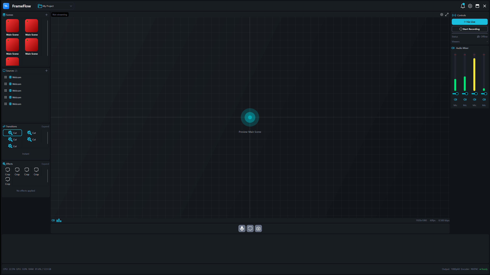

# FrameFlow

**FrameFlow** is a professional live production solution for broadcasters. Like OBS and similar software, it allows you to create and manage live content — but with a key difference: **a timeline-based workflow** that enables precise control, reuse, and automation of live events.

---

## 🎥 What is FrameFlow?

FrameFlow is designed for **live broadcasting, streaming, and real-time content creation**, combining traditional scene-based production with a **timeline-driven approach**.

This makes it possible to:

* Plan live events in advance
* Reuse full live productions or segments
* Control transitions and effects with frame-level precision
* Blend live and pre-recorded content seamlessly

FrameFlow is suitable for TV broadcasters, live stream producers, event operators, and production teams that need more structure than traditional scene switching.

---

## ✨ Key Features

* **Timeline-based live production**

  * Arrange scenes, sources, transitions, and effects on a timeline
  * Schedule and replay complex live events

* **Scene & Source Management**

  * Cameras, media files, graphics, audio inputs
  * Reusable scenes and nested compositions

* **Transitions & Effects**

  * Timeline-controlled transitions
  * Effects applied per scene or globally

* **Live + Recorded Hybrid Workflow**

  * Mix live inputs with recorded content
  * Reuse previous live events as editable timelines

* **Broadcast-Oriented Design**

  * Low-latency, real-time processing
  * Designed for continuous operation

---

## 🆚 FrameFlow vs OBS

| Feature                  | OBS     | FrameFlow |
| ------------------------ | ------- | --------- |
| Live switching           | ✅       | ✅         |
| Scenes & sources         | ✅       | ✅         |
| Timeline-based control   | ❌       | ✅         |
| Reuse live events        | ❌       | ✅         |
| Planned live productions | Limited | ✅         |
| Broadcast workflows      | Basic   | Advanced  |

FrameFlow complements and extends the classic live production model by introducing **time-based control**.

---

## 🖥 Screenshots

Example:

* Timeline with multiple scenes
* Transition effects between segments
* Live preview and program output

---

## 🚀 Typical Use Cases

* Live TV shows
* Sports broadcasting
* News production
* Live events and conferences
* Hybrid live + pre-recorded shows

---

## 📦 Project Status

FrameFlow is under active development.

Planned areas include:

* Extended effect system
* Automation and scripting
* Distributed / remote production
* Integration with broadcast and streaming standards

---

## 📄 License

TBD

---

## 🤝 Contributing

Contributions, feedback, and discussions are welcome.

If you are interested in broadcast software, real-time media, or live production workflows, feel free to get involved.
